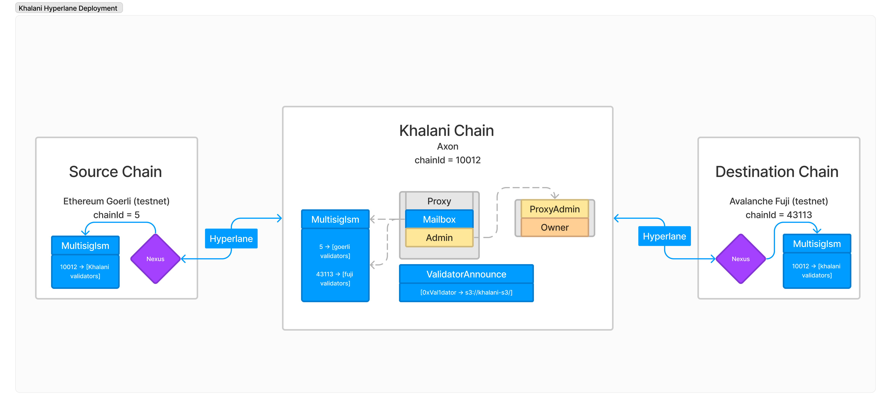

# Overview
This repository contains scripts and documentation on deploying Hyperlane core contracts to the Khalani chain, and `MultisigIsm` to remote chains that need to be connected.
Originally, this is a fork of [hyperlane-xyz/hyperlane-deploy](https://github.com/).  



# Quickstart

### 1. Install [foundry](https://github.com/foundry-rs/foundry#installation)
### 2. Install dependencies
  ```bash
  yarn install
  git submodule init && git submodule update --remote
  ```

### 3. Deploy Hyperlane core contracts to the Axon chain

- Configure the deployer's private key in [deploy-khalanitestnet.sh](deploy-khalanitestnet.sh)
  - Specify `<PRIVATE_KEY>`
- Configure the owner (admin) in [networks.json](config/networks.json)
  - Specify `<ADDRESS>`
- Deploy the core contracts (`MultisigIsm`, `Mailbox`, `InterchainGasPaymaster`, `ValidatorAnnounce`).
```
./deploy-khalanitestnet.sh
```

### 4. For each chain that needs to receive messages FROM Khalani
- Configure the deployer's private key
  - Specify `<PRIVATE_KEY>` in [deploy-multisig.sh](deploy-multisig.sh)
- Configure the owner (admin)
  - Specify `<ADDRESS>` in [deploy-multisig.sh](deploy-multisig.sh)
- Configure RPC URL of the node
  - Specify `<RPC_URL>` in [deploy-multisig.sh](deploy-multisig.sh)

```
./deploy-multisig.sh
```

# How it works
### Wallets

- `deployer` is the wallet that deploys the contracts, calls configuration functions, and pays for the gas
- `owner` is the admin wallet having configuration control on the deployed contracts

### On `deploy-khalanitestnet.sh`

- Deploy `ProxyAdmin`
  - Transfers ownership to the `owner`
- Deploy `MultisigIsm`
  - For each remote chain (`originChain`) that wants to pass messages **TO** Khalani:
    - call `enrollValidators` for each `originChain` -> `[0xVal1dator, 0xVal2dator, ...]`
    - call `setThreashold` set threshold required for the `originChain`
  - Transfers ownership to the `owner`
- Deploy `Mailbox`
  - deploy `implementation`
    - `contructor(originChainID)`
    - initialize `(owner, _defaultIsm)`
  - wrap with `TransparentUpgradeableProxy`
    - `constructor(ProxyAdmin, Mailbox)`
- Deploy `ValidatorAnnounce`
  - `constructor(Mailbox-address)`

### On `deploy-multisig.sh`
- Deploy `MultisigIsm` to the external chain (Goerli, Fuji...)
- Enroll Khalani validators to make `MultisigIsm` receive messages **FROM** Khalani
- Transfers ownership to the `owner`